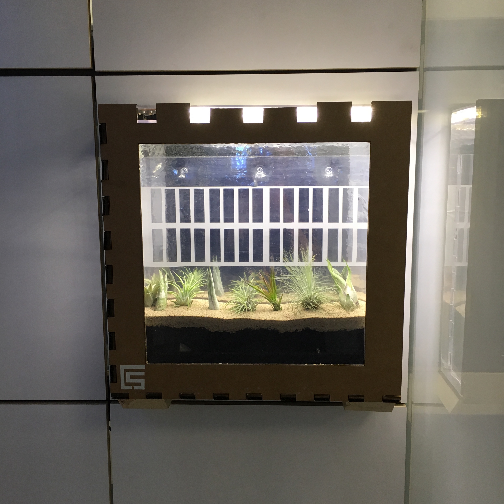

# Augmented Reality Terrarium
Augmented reality to mirror wall plants beyond their terrarium walls.

This is an augmented reality app, implemented with ARKit.  It was developed as part of project at the MIT Media Lab.
[More information here.](http://fab.cba.mit.edu/classes/MAS.863/CBA/people/alex/index.html)

The app searches for a terrarium of plants.  The terrarium has interior mirrors along its walls to reflect its plants in physical reality.
When the app finds the the terrarium, it reflects its plants beyond the terrarium walls with augmented reality.
